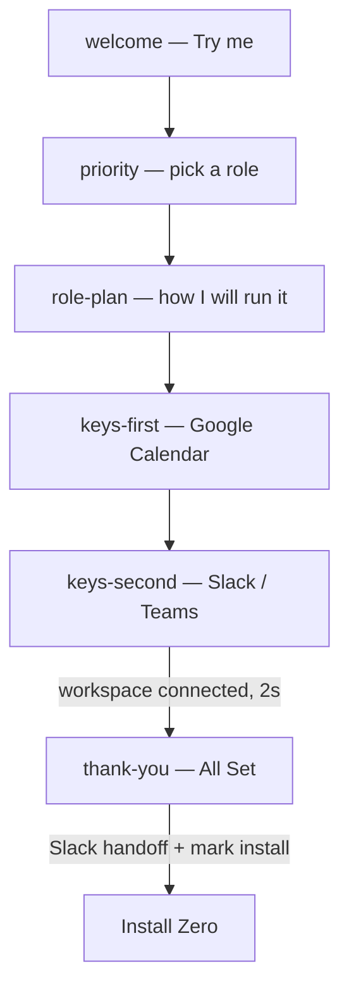
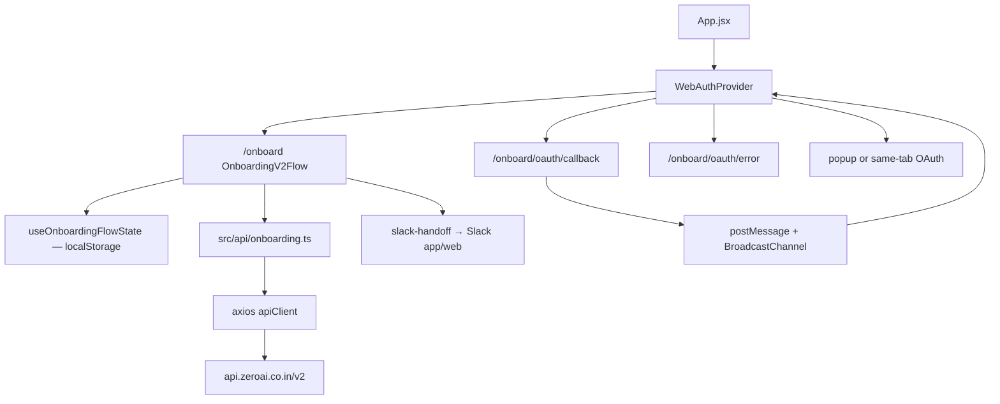

# Web Onboarding (`/onboard`)

As-built feature doc for the website onboarding flow on `feat/onboarding-web`. This is the product and architecture reference. The original porting brief is [`web-route.md`](./web-route.md); where they disagree, this document wins.

Users connect Google Calendar and Slack (or Teams) in the browser, then get handed into Slack. The Chrome Web Store install step is last, after that handoff.

---

## 1. What shipped

A full-screen `/onboard` flow (no Navbar/Footer), ported from the Chrome extension’s onboarding-v2 **live path**, with web-specific OAuth, Slack handoff, and an install screen.

| Area | Behavior |
|---|---|
| Route | `/onboard` — dark, full-screen takeover |
| Auth | Google then Slack/Teams OAuth. Desktop uses a popup; coarse pointer or `<768px` uses the same tab |
| Session | JWT in `localStorage` (`zero_web_auth_token`) |
| Finish | All Set → try Slack app/web → Install Zero (Chrome Web Store) |
| Language | TypeScript for onboarding; English copy only (no `chrome.i18n`) |
| Analytics | No-op stub |
| Storybook | Co-located `*.stories.tsx` under `src/components/onboarding/` |

Marketing pages stay as they were. Claim / Partner still use `fetch`. Only onboarding uses the axios client.

---

## 2. Routes

All of these skip the site shell.

| Path | Page | Role |
|---|---|---|
| `/onboard` | `src/pages/Onboard.tsx` | Flow |
| `/onboard/oauth/callback` | `src/pages/OnboardOAuthCallback.tsx` | Success return: persist JWT, notify opener, close or continue |
| `/onboard/oauth/error` | `src/pages/OnboardOAuthError.tsx` | Failure return: show code copy, mark key failed, auto-leave after 5s |
| `/onboard/slack-open-test` | `src/pages/SlackOpenTest.jsx` | Dev helper for Slack URL schemes |

Router basename follows Vite `BASE_PATH` (subdirectory deploys). Cloudflare SPA fallback: `public/_redirects` → `/* /index.html 200`.

---

## 3. User flow

Legacy stages `keys-complete`, `work-tools`, `wrap-up-confirm`, `wrap-up-time`, and `calendar-insight` are **not shown**. If stored state still points at them, the flow jumps to All Set (`thank-you`).



| Step | Screen | Behavior |
|---|---|---|
| `welcome` | `OnboardingWelcomeScreen` | Typed headline, **Try me** |
| `priority` | `OnboardingRoleSelectScreen` | Three roles: Close the loop / Manage meetings / Protect focus time |
| `role-plan` | `OnboardingRolePlanPanel` | Role-specific plan + preview. **Go back** / **Connect my tools** (starts Google OAuth after persisting `keys-first`) |
| `keys-first` | `OnboardingKeysSetupPanel` | Key 01 Google Calendar. CTA **Turn the first key** → `login()` |
| `keys-second` | same | Key 02 Slack/Teams. Slack: 3s progress then auto-open OAuth. Multi-provider: workspace picker |
| `thank-you` | `OnboardingAllSetScreen` | After both keys: wait 2s, mark completed. Auto-try Slack in 3s; fallback **Open app** / **Open web** |
| (after handoff) | `OnboardingInstallScreen` | **Install Zero** → Chrome Web Store. Shown when `zero_onboard_show_install` is set |

Roles: `focus` | `commitments` | `meetings`. Workspace: `slack` | `msteams` (default Slack).

Returning users with a JWT skip Google if `keyAuth.google` is not `failed`. Failed Google stays on `keys-first` so they can retry.

---

## 4. Architecture



UI lives in `src/components/onboarding/<Name>/` (component + stories + `index.ts`). Flow orchestration is `OnboardingV2Flow`.

---

## 5. OAuth

Reuse the Claim pattern (API-hosted start, website callback, JWT in the **hash fragment**), but keep `/onboard` in `localStorage` by using a popup on desktop.

`state` is `onboard_<uuid>`. Google’s `redirect_uri` stays the **API** callback. The website never passes a Google `redirect_uri`.

### Desktop vs mobile

| | Desktop (`pointer` fine and width ≥ 768) | Mobile (coarse pointer or width < 768) |
|---|---|---|
| Start | Blank popup on click, then navigate it | Navigate this tab |
| Return | Callback/error in the popup | Callback/error in this tab |
| Leave | Close the popup | `Continue` → `/onboard` |

Popup identity: `window.opener`, `window.name === 'zero-onboard-oauth'`, or `sessionStorage` flag `zero_onboard_oauth_popup`. Slack/Google often null `opener` (COOP), so the flag matters.

The parent listens on `postMessage` (same origin) **and** `BroadcastChannel('zero-onboard-oauth')` so Slack hops still wake `/onboard`.

### Google (Key 01) — `login()`

1. `setPendingOnboardingKeyAuth('google')`.
2. Open `{API_BASE}/auth/google?state=onboard_…`.
3. API redirects the window to `/onboard/oauth/callback#token=…` or `/onboard/oauth/error?code=…`.
4. Callback stores the JWT (`setAuthSession`), applies key-auth success, notifies the opener, leaves. It does **not** wait on `GET /auth/me` so the popup can close immediately.
5. `WebAuthProvider` hydrates `/auth/me` after the OAuth message (or on load).
6. Flow advances `keys-first` → `keys-second`.

### Slack / Teams (Key 02) — `connectIntegration(workspace)`

1. `setPendingOnboardingKeyAuth('slack' | 'msteams')`.
2. Authenticated `GET /auth/{provider}?state=onboard_…`. Expect JSON `{ data: { url } }`.
3. Navigate popup/tab to that URL. API must land on the same website callback/error paths.
4. On success, flow refetches `GET /onboarding?version=v3` for workspace connected + Slack handoff ids.
5. If this session newly connected Slack (not Google, not already connected), fire `POST /onboarding/execute/first/job?version=v3` once (fire-and-forget).
6. After 2s on `keys-second` with workspace connected → All Set.

### Error page

API contract: `/onboard/oauth/error?code=<ErrorCode>` plus optional `title` / `message`.

Known codes (keep in sync with the extension): `auth_failed`, `oauth_denied`, `integration_failed`, `email_mismatch`, `generic`. Unknown codes use generic copy. `email_mismatch` is a warning tone.

The error page marks the pending key `failed` and notifies the opener, then auto-leaves after 5 seconds.

---

## 6. Slack / Teams handoff

All Set prefers a Slack **bot DM** when v3 onboarding `workspace` has ids.

URL preference (`src/lib/slack-handoff.ts`):

1. Team + channel (`D…`) → Slack client channel (web) / `slack://channel`
2. Team + bot user → `app_redirect` / `slack://user`
3. Team only → workspace
4. Else Slack home

On load, All Set waits up to 3s (and refetches v3 if Slack ids are missing), then `tryOpenWorkspaceApp(slack://…)`. Because `slack://` may not navigate away, it then marks install and shows **Open app** / **Open web**. Those buttons use `https://` (`window.location.assign`) so the page actually leaves.

`zero_onboard_show_install` in localStorage (sessionStorage fallback) so returning to `/onboard` shows Install Zero instead of All Set again.

---

## 7. APIs

Base: `getApiBase()` → `https://api.zeroai.co.in/v2` (or `VITE_API_BASE_URL`). Call sites use `src/api/onboarding.ts` / `src/api/auth.ts`, not raw axios.

Identity is **Bearer token only**. Never send `user_id` query/body/`X-User-Id`.

| Call | Method | Path | When |
|---|---|---|---|
| `fetchAuthMe` | GET | `/auth/me` | Hydrate session |
| `login` start | GET | `/auth/google?state=onboard_…` | Key 01 (browser navigation) |
| Slack/Teams start | GET | `/auth/{slack\|msteams}?state=onboard_…` | Key 02 — JSON `{ data: { url } }` |
| `fetchOnboardingV3` | GET | `/onboarding?version=v3` | Keys / All Set — connected + `workspace` handoff ids |
| `saveOnboardingV3` | POST | `/onboarding?version=v3` | Available; live flow does not rely on wrap-up tools/EOD UI |
| `fireExecuteFirstOnboardingJob` | POST | `/onboarding/execute/first/job?version=v3` | New Slack connect this session |

**Not used on web (unlike the original port brief):** calendar analyze start/poll. There is no insight screen.

Request headers on axios: `Authorization`, `Content-Type`, `Accept`, `X-Platform: web`, `X-App-Version`, `X-Locale`, `X-Client-Timezone`, `X-Client-Timestamp`.

### Backend allowlist (required for Keys)

After OAuth, API `finalizeLogin` must redirect to this site, not the extension `auth-success` page:

- Success: `{website}/onboard/oauth/callback#token=<JWT>`
- Error: `{website}/onboard/oauth/error?code=…`
- Trigger: `state=onboard_…` (same idea as partner `claim_`)
- CORS origin for the website; optional env `ONBOARDING_WEB_SUCCESS_URL`

Without that redirect, the UI still renders; Google and Slack never complete on web.

---

## 8. Client state

### Onboarding (`OnboardingV2State`)

Stored via `useOnboardingFlowState`. Shape includes `status`, `stage`, `completed`, `flowData` (`selectedRole`, `workspace`, `selectedTools`, `wrapUpTime`, `keyAuth`).

| Key | Purpose |
|---|---|
| `zero_onboarding_v2_state` | Pre-login |
| `zero_onboarding_v2_state:{userId}` | After login (`syncAfterLogin` merges global → per-user) |
| `zero_onboarding_v2_owner_user_id` | Owner |
| `zero_onboarding_pending_key_auth` | Which key the popup is for |
| `zero_web_auth_token` / `zero_web_auth_user_id` | Session |
| `zero_onboard_show_install` | Skip All Set, show Install |
| `zero_onboard_oauth_same_tab` | Same-tab OAuth return to `/onboard` |
| `zero_onboard_oauth_popup` | This window is the OAuth popup |

`Storage` (`src/lib/storage.ts`) is a `localStorage` adapter with `get` / `set` / `remove` / `watch` (`StorageEvent`).

---

## 9. SPA subdirectory (`BASE_PATH`)

Vite `base` is `process.env.BASE_PATH` (default `/`). `BrowserRouter` uses that basename. Asset helpers (`publicUrl`) and OAuth return path honor it. CSS `url('/fonts/…')` is rewritten at build time when `BASE_PATH` is not `/`, otherwise fonts 404 under e.g. `/website-preview/`.

---

## 10. Storybook

```bash
npm run storybook          # http://localhost:6006
npm run build-storybook
```

Stories sit next to each onboarding component. Shared dark wrapper: `src/components/onboarding/_storybook/onboardingMeta.tsx`.

---

## 11. What differs from the extension / original brief

**Same**

- Welcome → role → plan → two keys, copy and motion
- v3 onboarding GET and execute-first-job
- Key-auth pending + success/failed in flow state

**Web-only**

- `chrome.storage` → `localStorage`
- Background messaging → axios + popup/same-tab OAuth
- English strings; analytics no-op
- All Set + Slack handoff instead of calendar-insight **Install Zero** as the keys finale
- Install Zero is a **later** screen, after Slack
- No calendar analyze polling
- No new-tab shell cache
