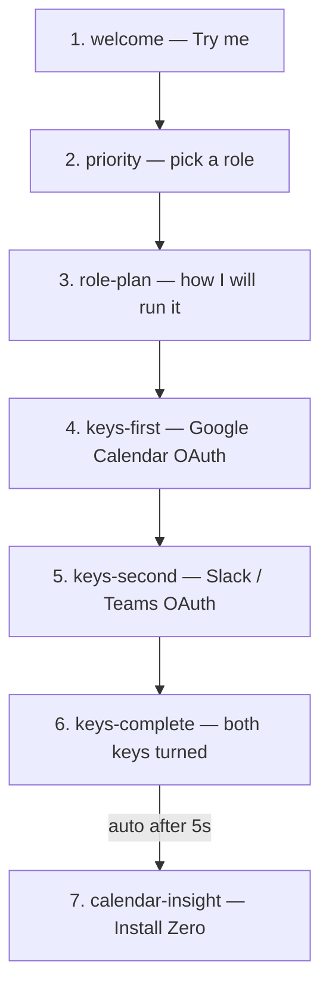
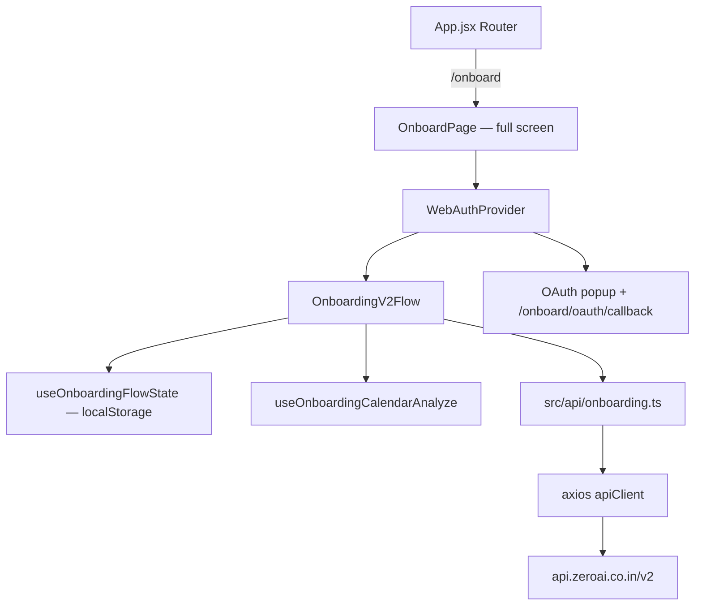

# Onboarding Web Route (`/onboard`) — porting brief

Original implementation brief used to port the Chrome extension’s onboarding-v2 flow onto the website.

**As-built product and architecture:** [`web-onboarding.md`](./web-onboarding.md). Prefer that document. This file is historical; several targets drifted (All Set + Slack handoff instead of calendar-insight as the finale, no calendar-analyze poll, popup **or** same-tab OAuth, dedicated error route).

**Extension source:** `../ext/src/components/client/onboarding-v2/`
**Website target:** `/onboard` (full-screen, no Navbar/Footer)

---

## 1. Goal

Port the latest extension onboarding **as-is**: same screens, copy, animations, API calls, and step logic.

**Exceptions:**

- No localization (`chrome.i18n` → hardcoded English fallbacks already in the ext copy helpers).
- Final CTA is **Install Zero** (Chrome Web Store), not **Open Zero**.
- No analytics for now (no-op stub).
- Dark-mode-only icons via direct SVG imports (no themed `Image` / `AssetName` system).
- Port **only** live-path UI (`OnboardingV2Flow` + children). Do not port unused/legacy onboarding screens.

---

## 2. Locked decisions

| Topic | Decision |
|---|---|
| Route | `/onboard` |
| Layout | Full-screen takeover — no Navbar, no Footer |
| Language | TypeScript (`.ts` / `.tsx`) for all new onboarding code |
| Auth | OAuth **popup**. Google's `redirect_uri` stays the API callback. After login, API must redirect popup to `/onboard/oauth/callback` (new allowlisted path) |
| Storage | `localStorage` adapter matching the extension `Storage` API (`get` / `set` / `remove` / `watch`) |
| Icons | Direct SVG imports, dark mode only |
| Analytics | Stub / no-op |
| Final button | Label **Install Zero**; `window.open(getChromeWebStoreUrl(), '_blank')` + mark onboarding completed |
| i18n | Skip; use English fallback strings from `onboarding-v2-i18n.ts` |
| API client | Axios layered client (not scattered `fetch`). Existing Claim/Partner pages keep `fetch` |
| Components | Port **only** live `OnboardingV2Flow` UI. Do not port unused/legacy screens |

---

## 3. User flow (active steps)

Legacy steps `work-tools`, `wrap-up-confirm`, `wrap-up-time`, and `thank-you` are auto-skipped to `calendar-insight`.



| Step | Screen | Behavior |
|---|---|---|
| `welcome` | `OnboardingWelcomeScreen` | Typed headline, subtext, **Try me**, `IntroCenterIllustration` |
| `priority` | `OnboardingRoleSelectScreen` | Typed question + 3 role cards: Close the loop / Manage meetings / Protect focus time |
| `role-plan` | `OnboardingRolePlanPanel` | Role-specific 3-step plan + preview. **Go back** / **Connect my tools** |
| `keys-first` | `OnboardingKeysSetupPanel` | Key 01 Google Calendar. CTA **Turn the first key** → `login()` |
| `keys-second` | same | Key 02 Slack/Teams. Single provider: 3s progress then auto-open OAuth. Multi-provider: workspace picker |
| `keys-complete` | same | Status **Both keys are turned. Starting now...** → auto-advance after 5s |
| `calendar-insight` | `OnboardingCalendarInsightPanel` + `OnboardingScheduleFlowLayout` | Calendar analyze result / loading copy. **Install Zero** |

Roles: `focus` | `commitments` | `meetings`. Workspace: `slack` | `msteams` (default Slack).

---

## 4. Architecture



### Website file layout (target)

```
src/
  pages/Onboard.tsx
  pages/OnboardOAuthCallback.tsx          # popup callback; postMessage + close
  context/WebAuthProvider.tsx
  api/onboarding.ts                       # service wrappers (port of ext server/Onboarding.ts)
  lib/
    storage.ts                            # localStorage Storage adapter
    utils.ts                              # cn()
    api/client.ts
    api/index.ts                          # routes
    onboarding-flow.ts
    onboarding-api.ts
    onboarding-storage.ts
    onboarding-key-auth.ts
    onboarding-calendar-analyze.ts
    onboarding-timeline-utils.ts
    onboarding-font.ts
    onboarding-tool-icon.ts
  hooks/
    useOnboardingFlowState.ts
    useOnboardingCalendarAnalyze.ts
    useOnboardingTyping.ts
    useAnalytics.ts                       # no-op
  data/static/onboarding.ts
  utils/onboarding-v2-i18n.ts
  components/onboarding/                  # port of ext onboarding-v2
  assets/onboarding/                      # SVG icons
```

Existing Claim / Partner pages stay on `fetch`. Only the onboarding module uses the axios client.

---

## 5. API requirements

No new `/onboarding/...` product APIs. Base URL: `getApiBase()` → `https://api.zeroai.co.in/v2` (or `VITE_API_BASE_URL`). UI/hooks call `src/api/onboarding.ts` wrappers, never axios directly.

### 5.1 Existing endpoints (website can call after JWT)

Port of `ext/src/components/server/Onboarding.ts`. All onboarding paths take `?version=v3`.

| Function | Method | Path | When | Auth |
|---|---|---|---|---|
| `fetchOnboardingV3` | GET | `/onboarding?version=v3` | Keys step — workspace / tools / EOD | Bearer |
| `saveOnboardingV3` | POST | `/onboarding?version=v3` | Complete — persist selections | Bearer |
| `requestCalendarAnalyze` | POST | `/onboarding/calendar/analyze?version=v3` | After Slack/Teams connects | Bearer |
| `fetchCalendarAnalyzeJob` | GET | `/onboarding/calendar/analyze/:jobId?version=v3` | Poll every 5s until terminal | Bearer |
| `requestExecuteFirstOnboardingJob` | POST | `/onboarding/execute/first/job?version=v3` | Install Zero if analyze completed | Bearer |
| Session | GET | `/auth/me` | After popup returns a token | Bearer |
| Connections | GET | `/integrations` | Map Slack/Teams `connected` | Bearer |
| Start Google | GET | `/auth/google` | Key 01 popup | Public |
| Start Slack/Teams | GET | `/auth/slack` or `/auth/msteams` | Key 02 popup | Bearer |

**POST `/onboarding` payload** (`OnboardingV3Payload`):

```ts
{
  workspace?: { selected: 'slack' | 'msteams' };
  tools_available?: { work_tools: string[]; code_tools: string[] };
  eod?: { user_time: string }; // 24h, e.g. "18:30"
}
```

GET `/onboarding` maps via `mapOnboardingV3Response()` (workspace providers, tool categories, wrap-up time). Same mapping as the extension — do not rewrite.

Calendar poll: `{ success, jobId, status, result: { name, date, botMessage, data: { events } } }`. Status: `queued` | `processing` | `completed` | `failed`. Poll interval: 5s.

Do **not** port deprecated `onboarding()` / `sendQuery()`.

### 5.2 Axios client (`src/lib/api/client.ts`)

Adapted from `ext/src/lib/api/client.ts`, **without** chrome.storage / background refresh for v1:

- `baseURL` = `getApiBase()`
- Identity: **Bearer token only**. Never send `user_id` / `userId` query params, body fields, or `X-User-Id`.
- Headers on every request:
  - `Authorization: Bearer <token>` (when a session exists)
  - `Content-Type: application/json`, `Accept: application/json`
  - `X-Platform: web`
  - `X-App-Version` (website version)
  - `X-Locale` (`navigator.language`, e.g. `en-US`)
  - `X-Client-Timezone`, `X-Client-Timestamp`
- Not sent (extension-only): `X-Extension-Version`, `X-Webhook-Enabled`, `X-Webhook-Scopes`
- Token refresh: skip for v1; can add later

Claim / PartnerSuccess keep using `fetch`.

### 5.3 Required API change (auth, not onboarding)

After Google/Slack OAuth, `finalizeLogin` redirects to **`DEFAULT_OAUTH_REDIRECT_URL`** (extension `auth-success`). A website popup never receives the JWT.

Partner claim is the only website exception: `state=claim_…` → `PARTNER_CLAIM_SUCCESS_URL` (`/partner/success#token=…`).

**Need on the API (allowlisted — not an open redirect):**

- Success URL, e.g. `{website}/onboard/oauth/callback`
- Trigger via `state=onboard_…` (same idea as `claim_`)
- Put JWT in the **hash fragment** (same as partner success), then scrub with `replaceState`
- Same post-OAuth redirect for Slack/Teams, or Key 02 never completes on web

Google's `redirect_uri` stays the **API** callback (`GOOGLE_REDIRECT_URI` → `/v1/auth/callback/google`). The website does **not** pass a Google `redirect_uri`.

**Config (not new APIs):** website origin in `CORS_ORIGINS`; optional env `ONBOARDING_WEB_SUCCESS_URL`.

Without this auth redirect, UI + authenticated onboarding calls still work; Keys (Google + Slack/Teams) will not complete on the web.

---

## 6. OAuth (popup)

Reuse the **Claim** idea (API-hosted Google start + website callback) but in a **popup** so `/onboard` state in `localStorage` is not lost. Depends on the API change in §5.3.

### Google (Key 01) — `login()`

1. Set pending key auth: `setPendingOnboardingKeyAuth('google')`.
2. Open popup: `{API_BASE}/auth/google?state=onboard_…` (no client `redirect_uri`).
3. API finishes Google OAuth, then redirects the popup to `/onboard/oauth/callback#token=…` (fragment, like partner success).
4. Callback page: read token from hash, `GET /auth/me` with Bearer, persist session in localStorage, `postMessage` the opener, close.
5. `WebAuthProvider` on `/onboard` receives the message (or re-reads storage on `focus` / `visibilitychange`) and sets `authenticated`.
6. Flow auto-advances `keys-first` → `keys-second`.

### Slack / MS Teams (Key 02) — `connectIntegration(workspace)`

Same as the extension background handler:

1. `setPendingOnboardingKeyAuth('slack' | 'msteams')`.
2. Authenticated preflight: open `{API_BASE}/auth/{provider}` with Bearer (or follow JSON `{ data: { url } }` if the API returns a URL).
3. Popup completes; API must redirect to the same website callback (or Keys never finish).
4. Refresh `GET /integrations` so `connections[workspace].connected === true`.
5. Flow auto-advances `keys-second` → `keys-complete`.

### Callback page

- Path: `/onboard/oauth/callback` (also full-screen, no shell).
- Read JWT from hash fragment; scrub with `history.replaceState` (same hygiene as `PartnerSuccess.jsx`).
- Apply `applyOnboardingKeyAuthResult(provider, 'success' | 'failed')` using pending key auth in localStorage.

`WebAuthProvider` must expose the same `useAuth()` surface the flow already uses:

`authenticated`, `userId`, `login()`, `connectIntegration(type)`, `connections`, plus user fields (`email`, `name`, `picture`, `token`).

---

## 7. State

### Shape (`OnboardingV2State`)

```ts
{
  version?: number;
  status?: 'not_started' | 'in_progress' | 'skipped' | 'completed';
  stage?: string; // OnboardingFlowStep
  currentStep?: number;
  onboardingStartTime?: string;
  updatedAt?: string;
  completed?: boolean;
  flowData?: {
    selectedRole?: 'focus' | 'commitments' | 'meetings';
    workspace?: 'slack' | 'msteams';
    selectedTools?: string[];
    wrapUpTime?: string;
    wrapUpFromTimePicker?: boolean;
    keyAuth?: Partial<Record<'google' | 'slack' | 'msteams', 'success' | 'failed'>>;
  };
}
```

### Storage keys

- Per-user: `zero_onboarding_v2_state:{userId}`
- Global (pre-login): `zero_onboarding_v2_state`
- Owner: `zero_onboarding_v2_owner_user_id`
- Pending OAuth: `zero_onboarding_pending_key_auth`
- Calendar analyze job: `onboarding_calendar_analyze_state`

Web adapter: `localStorage` + `StorageEvent` for `watch`. Drop chrome.storage.local / WXT / v1 `devbot_onboarding_tour` migration unless it is trivial to keep.

`useOnboardingFlowState` still hydrates, persists patches, and `syncAfterLogin(userId)` merges global → per-user.

---

## 8. UI port list

Do **not** copy the whole `onboarding-v2` folder. Port only what `OnboardingV2Flow` actually renders (plus its children). Legacy steps `work-tools`, `wrap-up-confirm`, `wrap-up-time`, `thank-you` are auto-skipped — do not bring those screens.

**Port (live path):**

`OnboardingV2`, `OnboardingV2Flow`, `OnboardingWelcomeScreen`, `IntroCenterIllustration`, `OnboardingRoleSelectScreen`, `OnboardingActionCard`, `OnboardingScreenShell`, `OnboardingRolePlanPanel`, `OnboardingUserBubble`, `OnboardingStatusMessage`, `OnboardingPlanPreviewCard`, `OnboardingPlanSteps`, `OnboardingPlanStep`, `OnboardingFooterActions`, `OnboardingTrustNote`, `RolePlanEntranceContext`, `OnboardingSchedulePreview`, `OnboardingThreadsToCalendarPreview`, `OnboardingMeetingTimelinePreview`, `OnboardingPreviewFrame`, `OnboardingKeysSetupPanel`, `OnboardingKeysPanel`, `OnboardingKeyItem`, `OnboardingWorkspacePicker`, `OnboardingScheduleFlowLayout`, `OnboardingScheduleStatus`, `OnboardingCalendarDayPreview`, `OnboardingCalendarInsightPanel`, `OnboardingPrimaryButton`

**Do not port:**

- Unused live-folder UI: `OnboardingWorkToolsPanel`, `OnboardingToolChip`, `OnboardingToolCategory`, `OnboardingWrapUpPanel`, `OnboardingTimeChip`, `OnboardingThankYouScreen`, `OnboardingContentPanel`
- Legacy v2: `SignUpScreen`, `CalendarPreview`, `ChatInterface`, `LoadingScreen`, `FinalScreen`, `ProgressIndicator`, `BotMessageWithInput`, `BotMessageWithButtons`, `ChatSidebar`
- All `.stories.tsx`, v1 `Onboarding.tsx`, `OnboardingProvider`

If `onboarding-api.ts` needs `OnboardingWorkToolCategory` types, extract **types only** — do not bring the work-tools UI.

### Adaptations in every component

- `@/context/AuthProvider` → `@/context/WebAuthProvider`
- `chrome.i18n` / `onboardingV2Msg` → return the English fallback only
- Themed `Image` / `AssetName` → simple SVG map or ``
- `cn` from local `src/lib/utils.ts` (`clsx` + `tailwind-merge`)
- Drop Storybook files (`.stories.tsx`)

### Final screen change

In `OnboardingCalendarInsightPanel`:

- Button label: **Install Zero** (replace `copy.openZero`)
- Click: `handleComplete()` (save v3 payload, mark completed, fire execute-first-job if analyze completed) **and** `window.open(getChromeWebStoreUrl(), '_blank')`

Do not call `saveNewTabStartupShellCache` (extension-only).

---

## 9. Assets, fonts, CSS

**SVGs:** copy `ext/src/assets/vectors/onboarding/` → `website/src/assets/onboarding/`.

Known icons: `role-chat`, `role-meeting`, `role-target`, `key-light`, `arrow-clockwise-light`, `moon-stars-fill`, `chats-light`, `code-light`, plus check/x/lock/hourglass/calendar/etc.

External favicons stay as URLs (Slack, Teams, Linear, Jira, Notion, …).

**Fonts:** Instrument Sans (`font-instrumentSans`), Aeonik TRIAL (`font-aeonik`). Load via Google Fonts or self-host; register in Tailwind / CSS.

**CSS to port:**

- Animations: `onboarding-fade-in`, `onboarding-slide-down`
- Tokens: `--foreground-primary`, `--foreground-secondary`, `--foreground-muted`, `--gradient-from`, `--gradient-to`, `--background`
- Dark class on the onboard shell (onboarding is dark-themed)

---

## 10. Routing

In `src/App.jsx`:

- Lazy-load `Onboard` and `OnboardOAuthCallback`
- Routes: `/onboard`, `/onboard/oauth/callback`
- Navbar + Footer only on a layout route that **does not** wrap these two

---

## 11. Dependencies

- `typescript`, `@types/react`, `@types/react-dom` (dev)
- `axios`
- `clsx`, `tailwind-merge`
- `date-fns`

Also: `tsconfig.json` with `@/` → `src/`, and `vite.config.js` `resolve.alias`.

---

## 12. What stays the same vs what changes

**Same as extension**

- Screens, copy, animations, step resolver
- All v3 onboarding endpoints, payloads, polling
- When each call fires in `OnboardingV2Flow`
- Calendar analyze job lifecycle
- Key-auth pending + success/failed persistence

**Different on web**

- `chrome.storage` → `localStorage`
- Background messaging → axios + popup OAuth
- `chrome.i18n` → English strings
- Analytics → no-op
- Open Zero → Install Zero (Web Store)
- No new-tab shell cache / appearance popover unless it is a small isolated port

---

## 13. Implementation order

1. TypeScript + Vite alias + deps
2. `Storage` adapter
3. Axios client + routes
4. `WebAuthProvider` + OAuth callback page
5. Port lib / hooks / i18n (English-only)
6. Port **live-path** components + SVGs + simplified icon map (not unused screens)
7. Fonts + onboarding CSS
8. Wire `/onboard` full-screen routes
9. Final CTA: Install Zero
10. API allowlisted OAuth redirect (`state=onboard_…`) — required for Keys
11. Walk the full flow (welcome → keys → insight → store)

---

## 14. Extension files to treat as canonical

| Area | Path under `../ext/src/` |
|---|---|
| Flow orchestrator | `components/client/onboarding-v2/OnboardingV2Flow.tsx` |
| Step types / resolver | `lib/onboarding-flow.ts` |
| V3 payload mapping | `lib/onboarding-api.ts` |
| HTTP wrappers | `components/server/Onboarding.ts` |
| Routes | `lib/api/index.ts` (`routes.onboarding`, `routes.auth`, `routes.integrations`) |
| Storage | `lib/onboarding-storage.ts`, `hooks/useOnboardingFlowState.ts` |
| Key OAuth | `lib/onboarding-key-auth.ts` |
| Calendar analyze | `lib/onboarding-calendar-analyze.ts`, `hooks/useOnboardingCalendarAnalyze.ts` |
| Copy | `utils/onboarding-v2-i18n.ts` |
| Google OAuth callback pattern | `tabs/auth-success.tsx` |
| Integration popup | `background/messages/integration.ts` (`PREFLIGHT_INTEGRATION_OAUTH`) |
| Website OAuth hygiene (fragment/query scrub) | `website/src/pages/PartnerSuccess.jsx` |
